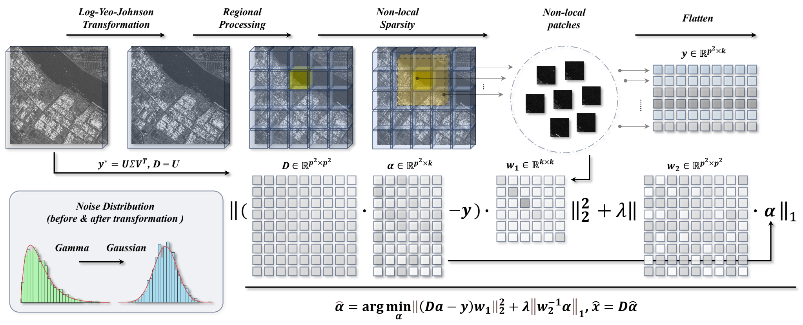

# CLASP — Closed-form Analytic Sparse Despeckling of SAR Imagery

Training-free SAR despeckling in which no constant is tuned per image: each one follows from the number of looks and the shape of the patch group.



Similar patches are grouped, each group is coded on its own left singular basis, and the coefficients are shrunk by one soft threshold. Two structural facts do the work. **The dictionary is orthonormal**, so the weighted lasso separates over coefficients and is solved exactly — no ADMM, no penalty parameter — and the two weighting matrices turn out to be the numerator and denominator of one threshold, `tau_ik = sigma_k^2 / S_i = w_2i / w_1k^2`. **The dictionary is estimated from the noisy group**, so the retained subspace absorbs speckle in proportion to the aspect ratio `gamma = p^2 / K`, and the Marchenko–Pastur edge fixes the correction analytically: `c*(gamma, L) = a(L)(1 + sqrt(gamma)) + b(L)`.

## Install

```bash
pip install -r requirements.txt
```

CUDA is recommended; on CPU a 512×512 image takes minutes rather than seconds.

## Use

```bash
python despeckle.py scene.png out.png              # looks estimated from the image
python despeckle.py noisy_dir/ out_dir/ --looks 4
```

```python
import cv2, torch
from nlsc import despeckle_image

obs = torch.tensor(cv2.imread("scene.png", 0).astype("float32"), device="cuda")
est = despeckle_image(obs, L=4)
```

## Samples

`samples/` holds the scenes the paper's figures are built from, with their outputs, so the repository can be checked without downloading the benchmarks. PSNR and SSIM are `observation → despeckled`, `data_range = gt.max() - gt.min()`:

| scene | looks | PSNR (dB) | SSIM (%) |
|---|---|---|---|
| `set12_01` | 1 | 10.92 → 20.68 | 14.74 → 63.57 |
| `mcmaster_08` | 2 | 16.56 → 25.75 | 55.17 → 85.33 |
| `kodak24_07` | 4 | 13.62 → 20.45 | 34.05 → 68.14 |

Real SAR admits no reference, so the estimate is judged by how closely the ratio image `y/xhat` follows the speckle model it must obey if the estimate is correct — `E[r] = 1` and `L·Var[r] = 1`:

| scene | est. looks | \|E[r]−1\| | \|L·Var[r]−1\| |
|---|---|---|---|
| `gaofen3` | 3 | 0.025 | 0.402 |
| `sentinel1` | 4 | 0.022 | 0.492 |
| `minisar` | 16 | 0.007 | 0.127 |

## Reproducing the paper

Two runners, each carrying the settings its own results were produced with; neither needs a flag beyond the dataset.

```bash
# synthetic: reference available, PSNR/SSIM reported, b = 1
python scripts/run_synthetic.py --root /data --dataset Set12 --enl 1 2 4 8

# real: looks estimated per image, b = 0, dark-outlier repair, and per-sensor
# noise-level exceptions applied automatically
python scripts/run_real.py --root /data --dataset Sentinel-1
python scripts/run_real.py --root /data --dataset miniSAR
```

Expected layout:

```
<root>/<dataset>/<base>.png                                 ground truth
<root>/<dataset>_noisy/Noisy/<base>_gamma_noise_ENL<L>.png  synthetic observation
<root>/<dataset>/origin/*.png                               real observation
```

## Settings

| quantity | value | source |
|---|---|---|
| patch size `p` | 10 | interior optimum, flat from 10 to 12 |
| stacking number `K` | 20 | with `p` gives `gamma = 5` |
| Yeo-Johnson `lambda` | `lambda*(L)` | `nlsc.lambda_star` |
| threshold constant `c` | `c*(gamma, L)` | `nlsc.c_star`, Marchenko–Pastur edge |
| rank cutoff `r` | 1.5 (1.0 at one look) | `nlsc.baseline` |
| matching bandwidth `b` | 1 synthetic, 0 real | optimum flat; 0 to 1 spans 0.4 dB |
| noise floor `eta` | 0.2 | `nlsc.baseline` |
| outer iterations | 12 | |

Two settings are not derived, and are documented rather than hidden:

- **`c` at one look.** `c*(gamma, L)` is calibrated for `L >= 2`; below that the optimum runs past the search grid without turning over, so `c_star` refuses to extrapolate and the fixed `C_ONE_LOOK = 1.5` is used.
- **The noise level on the finest imagery.** The blind estimator needs the low end of the patch covariance spectrum to be free of scene content. On 0.1 m miniSAR imagery it is not and the thresholds collapse, so the model-based level is substituted at twice `sigma_model(L)` — the factor the estimator itself returns on the other five configurations. `scripts/run_real.py` applies this by sensor name and says so when it does.

## Determinism

Nothing is selected by comparing candidate reconstructions, so the algorithm makes no data-dependent discrete choices. GPU reductions are not bit-exact, however, so repeated runs agree to within a grey level or two on almost all pixels; run on CPU if you need exact reproducibility.

## Layout

```
nlsc/          despeckle_image (entry point), pipeline, grouping and shrinkage,
               group SVD, patches, transforms, lambda*(L), c*(gamma,L), ENL
               estimation, robust repair
despeckle.py   command-line interface
scripts/       run_synthetic.py and run_real.py, one per experiment family
samples/       the scenes shown in the paper, with their outputs
docs/          the pipeline figure
```

## License

Non-commercial use only: teaching, academic research, public demonstrations and personal experimentation. See `LICENSE`.
